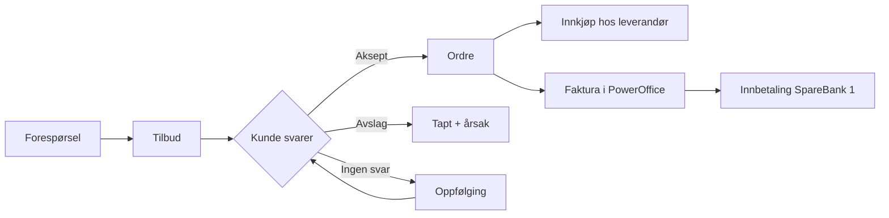
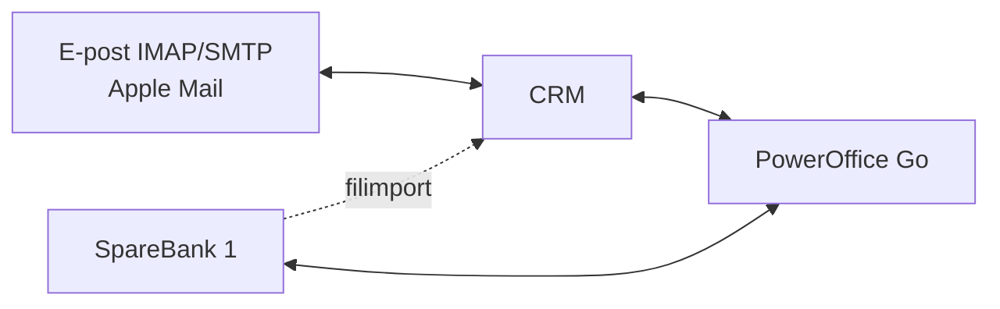
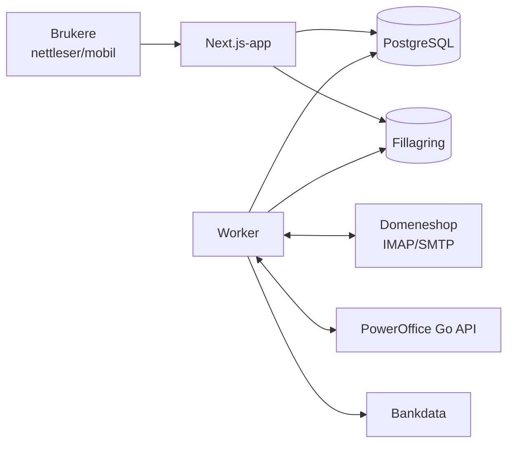

# Kravspesifikasjon – CRM-system for Pietra Unica

Versjon: 2026-09-21

## 1. Innledning

Dette dokumentet er kravspesifikasjon og byggebeskrivelse for et eget CRM-system for Pietra Unica (marmor.no), som utvikles med Claude Code. Systemet samler kunder, leverandører, e-post, dokumenter, tilbud, ordre og bilag på ett sted, integrert med PowerOffice Go og SpareBank 1. Målet er å fjerne dobbeltregistrering, sikre at ingen tilbud glemmes, og gi full historikk per kunde og leverandør.

**Omfang:** kundedatabase, leverandørdatabase, bilagsdatabase, e-postintegrasjon, dokumentarkiv, tilbuds- og ordremodul, oppfølging, gruppeutsendelser, styrende dokumenter og materialbibliotek.

**Prioritering av krav:**

| Kode | Betydning |
| --- | --- |
| MÅ | Skal være på plass før milepælen regnes som ferdig. |
| BØR | Bygges når MÅ-kravene i milepælen er ferdige, ellers i M8. |
| KAN | Bygges kun etter avtale med eier. |

Hvert krav har en ID (f.eks. KU-01) som brukes i kode, tester og commit-meldinger. Kapittel 2–14 beskriver *hva* systemet skal gjøre. Kapittel 15–20 beskriver *hvordan* det bygges: stack, kjøremiljø, datamodell, integrasjoner, byggeplan og arbeidsregler. Kapittel 21 lister det som må avklares.

## 2. Generelle krav

| ID | Krav | Prioritet |
| --- | --- | --- |
| GE-01 | Systemet brukes i nettleser (Safari, Chrome, Firefox) på Mac, PC, nettbrett og mobil, og kjører på egen Mac eller Mac mini (kap. 16). Ingen skyløsning. | MÅ |
| GE-02 | Brukergrensesnitt på norsk. Tilbud, ordre og e-post skal kunne genereres på norsk og engelsk. | MÅ |
| GE-03 | Rollebasert tilgangsstyring med én administratorrolle og selgerrolle for 10 brukere ved oppstart. Administrator skal selv kunne opprette nye roller og justere rettigheter senere (f.eks. innkjøp, økonomi, lesetilgang). En bruker kan ha flere roller. | MÅ |
| GE-04 | Innlogging med tofaktorautentisering. | MÅ |
| GE-05 | Felles søk på tvers av kunder, leverandører, dokumenter, e-post, tilbud, ordre og bilag. | MÅ |
| GE-06 | Alle registreringer og endringer skal logges med bruker og tidspunkt (revisjonsspor). | MÅ |
| GE-07 | Oppgaver og påminnelser per bruker, med oversikt (dashboard) over dagens oppgaver, åpne tilbud og forfalte oppfølginger. | MÅ |
| GE-08 | Mobiltilpasset visning for bruk på lager, befaring og montasje, inkl. opplasting av bilder fra mobilkamera. Tilgjengelig på kontornettet i servermodus, og utenfor kontoret når DR-15 er på plass. | BØR |
| GE-09 | Egendefinerte felt på kunder, leverandører, tilbud og ordre uten programmering. | BØR |
| GE-10 | Rapporter og eksport til Excel/CSV (salg per kunde, per kundegruppe, per materiale, tilbudskonvertering). | BØR |
| GE-11 | Åpent API (REST) for fremtidige integrasjoner. Systemet skal kunne integreres mot en fremtidig nettbutikk på marmor.no (materialer, priser, lager, kunder og ordre). | BØR |
| GE-12 | Kalenderintegrasjon (f.eks. Apple Kalender / iCloud via CalDAV) for møter, befaringer og leveranser. | KAN |
| GE-13 | Tidssone Europe/Oslo, norsk dato- og tallformat (dd.mm.åååå, 1 234,50) og NOK som hovedvaluta. | MÅ |

## 3. Kundedatabase

Kundekortet skal gi komplett oversikt over én kunde: stamdata, kontakter, all korrespondanse, dokumenter, tilbud, ordre og betalinger.

| ID | Krav | Prioritet |
| --- | --- | --- |
| KU-01 | Stamdata: navn, organisasjonsnummer, besøksadresse, fakturaadresse, leveringsadresse(r), e-post, telefon. | MÅ |
| KU-02 | Skille mellom bedriftskunder og privatkunder. Bedrifter kan ha flere kontaktpersoner med rolle, e-post og telefon. | MÅ |
| KU-03 | Kredittinformasjon: kredittgrense, betalingsbetingelser, utestående saldo (hentet fra PowerOffice) og varsel ved overskredet grense. | MÅ |
| KU-04 | Kundegrupper (f.eks. privat, entreprenør, arkitekt, interiørarkitekt, forhandler, kjøkkenprodusent). En kunde kan tilhøre flere grupper. | MÅ |
| KU-05 | Fritekstfelt for kommentarer og interne notater, med dato og forfatter. | MÅ |
| KU-06 | Tidslinje per kunde som viser all aktivitet kronologisk: e-post, notater, telefonsamtaler, tilbud, ordre, fakturaer og innbetalinger. | MÅ |
| KU-07 | Automatisk oppslag i Brønnøysundregistrene ved registrering av organisasjonsnummer. | BØR |
| KU-08 | Synkronisering av kunderegister med PowerOffice Go, slik at kunden kun registreres ett sted. | MÅ |
| KU-09 | Kobling mellom kunder og prosjekter (f.eks. én arkitekt, flere byggeprosjekter med ulike sluttkunder). | BØR |
| KU-10 | Duplikatkontroll ved registrering (navn, e-post, org.nr.). | BØR |
| KU-11 | Registrering av samtykke til nyhetsbrev/markedsføring med dato og kilde. | MÅ |
| KU-12 | Systemet starter med tomme registre. Import fra CSV (f.eks. eksportert fra Numbers) kan legges til senere. | KAN |

## 4. E-postintegrasjon

All inngående og utgående e-post til og fra kunder og leverandører skal automatisk kobles til riktig kort, uten at brukeren må gjøre noe.

| ID | Krav | Prioritet |
| --- | --- | --- |
| EP-01 | Toveis integrasjon mot eksisterende e-postkontoer via IMAP/SMTP, uten bytte av e-postleverandør (i dag Domeneshop). Brukerne fortsetter i Apple Mail (Mac, iPhone, iPad), og e-post sendt og mottatt der skal fanges opp av CRM. Synk starter fra datoen systemet tas i bruk, og eldre e-post hentes ikke. | MÅ |
| EP-02 | Inngående og utgående e-post kobles automatisk til kunde eller leverandør basert på avsender-/mottakeradresse og domene. | MÅ |
| EP-03 | Gjelder alle brukeres postbokser og bedriftens felles postbokser (f.eks. post@ og ordre@). Administrator styrer hvilke roller som har tilgang til hver felles postboks, og det skal vises hvem som har behandlet en e-post. | MÅ |
| EP-04 | Vedlegg lagres automatisk i dokumentarkivet til kunden/leverandøren (se kap. 5). | MÅ |
| EP-05 | E-post som ikke kan kobles automatisk, havner i en kø for manuell tilordning. | MÅ |
| EP-06 | E-post kan i tillegg kobles til et bestemt tilbud, en ordre eller et prosjekt. | MÅ |
| EP-07 | Mulighet til å fjerne en enkelt e-post fra CRM ved behov. | KAN |
| EP-08 | Sende e-post direkte fra CRM med maler og flettefelt, sendt via SMTP og lagret i IMAP-mappen Sendt, slik at den også vises i Apple Mail. | BØR |
| EP-09 | Trådvisning av samtaler per kunde og per tilbud. | BØR |
| EP-10 | Manuell kobling fra Apple Mail, f.eks. ved videresending eller BCC til en egen CRM-adresse. | KAN |

## 5. Dokumenthåndtering

Hver kunde, leverandør og hvert prosjekt skal ha et eget dokumentarkiv med tegninger, bilder, e-poster og tilbud, både sendt og mottatt.

| ID | Krav | Prioritet |
| --- | --- | --- |
| DO-01 | Opplasting av alle vanlige filtyper: PDF, DWG/DXF, bilder (JPG, PNG, HEIC), Office-filer. | MÅ |
| DO-02 | Dokumenter kategoriseres (tegning, bilde, tilbud sendt, tilbud mottatt, ordrebekreftelse, faktura, kontrakt, annet). | MÅ |
| DO-03 | Forhåndsvisning av PDF og bilder direkte i systemet uten nedlasting. | MÅ |
| DO-04 | Versjonering av dokumenter, særlig tegninger (rev. A, B, C) med visning av hvilken versjon som er gjeldende. | MÅ |
| DO-05 | Dra-og-slipp-opplasting og opplasting fra mobilkamera (f.eks. bilder fra befaring eller av ferdig montert benkeplate). Mobilopplasting fungerer på kontornettet når Mac mini er i drift, og utenfor kontoret når DR-15 er på plass. Inntil da overføres bildene til Macen (f.eks. med AirDrop) og dras inn. | MÅ |
| DO-06 | Fulltekst-søk i dokumenter, inkludert tekstgjenkjenning (OCR) i skannede PDF-er. | BØR |
| DO-07 | Dokumenter deles med kunde som vedlegg i e-post sendt fra CRM. Delingslenker brukes ikke, fordi serveren ikke skal være åpen mot internett. | BØR |
| DO-08 | Lagringskapasitet på minst 500 GB, med mulighet for utvidelse. Fillagring skal kunne utvides uten kodeendring. | MÅ |
| DO-09 | Visning av DWG-filer i nettleser. | KAN |

## 6. Tilbud og ordre

Selgeren skal kun fylle inn det som er unikt for jobben (kunde, mål, materiale, pris). Standardtekst som vilkår, leveringsbetingelser, forbehold og vedlikeholdsråd genereres automatisk.



Flyten over viser hvordan tilbud, ordre, faktura og betaling skal henge sammen i systemet.

| ID | Krav | Prioritet |
| --- | --- | --- |
| TO-01 | Tilbudsmaler med logo og profil, der vilkår, betalingsbetingelser, leveringsbetingelser, forbehold og gyldighet settes inn automatisk. | MÅ |
| TO-02 | Ulike maler og vilkår per kundegruppe (f.eks. privat med angrerett-informasjon, næring, forhandler) og per språk. | MÅ |
| TO-03 | Tekstblokker som kan velges inn (f.eks. vedlikeholdsråd for marmor, montering, måltaking, natursteinens naturlige variasjon). | MÅ |
| TO-04 | Varelinjer kan hentes fra materialbiblioteket (kap. 13) eller skrives fritt, med antall, enhet (m², løpemeter, stk) og pris. Detaljer om bearbeiding og produksjon håndteres i den interne tilbudsprosessen, ikke i CRM. | MÅ |
| TO-05 | Automatisk beregning av sum, rabatt, MVA og dekningsbidrag (DB vises kun internt). | MÅ |
| TO-06 | Tilbud genereres som PDF og sendes direkte fra systemet. Sendt tilbud lagres automatisk på kunden. | MÅ |
| TO-07 | Status på tilbud: utkast, sendt, besvart, akseptert, avslått, utløpt. Årsak ved tap registreres. | MÅ |
| TO-08 | Akseptert tilbud konverteres til ordre med ett klikk, og ordrebekreftelse genereres fra mal. | MÅ |
| TO-09 | Ordre overføres til PowerOffice Go for fakturering (kunde, linjer, MVA, prosjekt). | MÅ |
| TO-10 | Revisjoner av tilbud (versjon 1, 2, 3) med sporing av hva som er endret. | MÅ |
| TO-11 | Kunden aksepterer tilbudet ved å svare på e-posten. CRM gjenkjenner svaret i tilbudstråden og foreslår status «akseptert», som selger bekrefter med ett klikk. | BØR |
| TO-12 | Delfakturering og forskudd (f.eks. 50 % ved bestilling, rest ved levering). | BØR |
| TO-13 | Fra ordre: generer innkjøpsforespørsel/bestilling til leverandør. | BØR |
| TO-14 | Leverandørtilbud kommer på e-post. Vedlegg fra leverandører kan merkes som «tilbud mottatt» og kobles til kundens tilbud for margkontroll. | BØR |
| TO-15 | Løpende nummerering fra oppstart med prefiks per type: tilbud T-10001, ordre O-10001, innkjøp I-10001. Revisjoner av tilbud får suffiks (T-10001-2). Nummer gjenbrukes aldri, heller ikke ved sletting. Fakturanummer kommer fra PowerOffice. | MÅ |

## 7. Tilbudsoppfølging og historikk

Ingen sendte tilbud skal bli liggende uten oppfølging. Systemet skal støtte både automatiske påminnelser til kunden og manuelle oppgaver for selgeren.

| ID | Krav | Prioritet |
| --- | --- | --- |
| OP-01 | Full historikk per kunde og leverandør over tilbud, ordre og øvrig kontakt (e-post, telefon, møter, notater). | MÅ |
| OP-02 | Manuell oppfølging: selger setter dato og oppgave på tilbudet og får varsel. | MÅ |
| OP-03 | Automatisk oppfølging: regelsett som sender påminnelse til kunden etter X dager uten svar (f.eks. dag 7 og dag 14), basert på mal. | MÅ |
| OP-04 | Automatisk oppfølging stopper når kunden svarer på e-post eller tilbudet får ny status. | MÅ |
| OP-05 | Administrator setter en standard oppfølgingsregel. Den kan overstyres per kunde og per tilbud (antall dager, antall påminnelser, av/på) direkte der man jobber med tilbudet. | MÅ |
| OP-06 | Varsel til selger når tilbud nærmer seg utløp av gyldighet. | MÅ |
| OP-07 | Oversikt (pipeline) over åpne tilbud med verdi, status, sannsynlighet og neste oppfølgingsdato. | MÅ |
| OP-08 | Registrering av telefonsamtaler og møter med notat direkte på kunden. | MÅ |
| OP-09 | Varsel til selger når kunden svarer på et tilbud. | KAN |
| OP-10 | Etter levering: automatisk e-post med vedlikeholdsråd og forespørsel om omtale. | KAN |

## 8. Gruppebasert e-postutsendelse

Systemet skal kunne sende nyhetsbrev og kampanjer til utvalgte kundegrupper, i tråd med markedsføringsloven og GDPR. Forventet volum er under 100 mottakere og maks to utsendelser i måneden de neste tre årene, så utsendelse via Domeneshop sin SMTP er tilstrekkelig. Gir leveringen problemer senere, kan en ekstern tjeneste som Brevo (gratisplan) kobles på uten å endre resten av systemet.

| ID | Krav | Prioritet |
| --- | --- | --- |
| GR-01 | Utsendelse til en eller flere kundegrupper, eller til utvalg basert på filter (f.eks. kjøpt siste 12 måneder, geografisk område, materialinteresse). | MÅ |
| GR-02 | Kun mottakere med gyldig samtykke eller kundeforhold inkluderes automatisk. | MÅ |
| GR-03 | Alle utsendelser har avmelding via e-post: List-Unsubscribe-header med mailto, og teksten «svar AVMELD for å melde deg av». Svaret fanges opp av e-postsynken, og avmeldingen registreres automatisk på kunden. | MÅ |
| GR-04 | Maler med flettefelt (navn, firma, kontaktperson) og bilder, f.eks. fra materialbiblioteket. | MÅ |
| GR-05 | Planlagte og automatiske utsendelser (f.eks. nye materialer på lager, sesongkampanjer, julehilsen). | MÅ |
| GR-06 | Statistikk: sendt, returnert (bounce, lest fra innboksen) og avmeldt. Åpning og klikk måles ikke, fordi det krever at serveren er åpen mot internett. Utsendelsen logges på hver mottakers tidslinje. | BØR |
| GR-07 | Utsendelser går via Domeneshop sin SMTP fra en egen avsenderadresse (f.eks. nyhetsbrev@marmor.no), én e-post per mottaker (aldri BCC). Sendehastigheten begrenses til en konfigurerbar grense per time, og utsendelsen fortsetter automatisk etter pause eller omstart. Mottakere som gir permanent retur (bounce), merkes og utelates neste gang. | MÅ |

## 9. Leverandørdatabase

Leverandørkortet skal fungere som kundekortet, men støtte internasjonale leverandører (f.eks. steinbrudd og fabrikker i Italia) og kobles tett mot fakturaflyt og betaling.

| ID | Krav | Prioritet |
| --- | --- | --- |
| LE-01 | Stamdata: navn, internasjonal adresse (land, region, postnummer i ulike formater), e-post, telefon med landkode, nettside. | MÅ |
| LE-02 | Flere kontaktpersoner med rolle (salg, logistikk, økonomi) og språk. | MÅ |
| LE-03 | Kreditt og betingelser: kredittramme, betalingsbetingelser, valuta (NOK, EUR, USD m.fl.), leveringsbetingelser (Incoterms). | MÅ |
| LE-04 | Bankinformasjon (IBAN, BIC/SWIFT) synkronisert med PowerOffice. | MÅ |
| LE-05 | Kommentarer og interne notater, f.eks. kvalitet, leveringstid og erfaringer. | MÅ |
| LE-06 | E-postintegrasjon som for kunder (kap. 4). | MÅ |
| LE-07 | PDF-fakturaer som kommer på e-post fra leverandør, lastes automatisk opp til PowerOffice Go sitt fakturamottak med riktig leverandør. EHF-fakturaer går direkte til PowerOffice og hentes derfra. | MÅ |
| LE-08 | Sporing av gjennomførte betalinger til leverandør via SpareBank 1, med status ubetalt / betalt / delvis betalt per faktura. | MÅ |
| LE-09 | Historikk over tilbud mottatt, bestillinger sendt, ordrebekreftelser og øvrig kontakt. | MÅ |
| LE-10 | Oppfølging av åpne bestillinger og forventet leveringsdato, med varsel ved forsinkelse. | BØR |
| LE-11 | Kobling av leverandør til materialer i materialbiblioteket (hvem leverer hva, til hvilken pris). | BØR |
| LE-12 | Registrering av sertifikater og dokumentasjon (CE-merking, ytelseserklæring, opprinnelse). | KAN |

## 10. Bilagsdatabase

PowerOffice er arkiv og fasit for bilag. CRM skal ikke bygge et eget bilagsarkiv, tolke bilag eller håndtere attestering. CRM sender PDF-fakturaer fra e-post til PowerOffice og viser bilag og betalingsstatus fra PowerOffice der det er nyttig: på leverandør, ordre og prosjekt.

| ID | Krav | Prioritet |
| --- | --- | --- |
| BI-01 | PDF-fakturaer som kommer på e-post eller lastes opp manuelt, sendes til PowerOffice sitt fakturamottak, koblet til riktig leverandør. | MÅ |
| BI-02 | Beløp, forfall og status for bilag hentes fra PowerOffice etter at bilaget er registrert der. CRM tolker ikke bilag selv. | MÅ |
| BI-03 | Bilag og betalingsstatus (ubetalt, betalt, delvis betalt) vises på leverandørkortet og på ordren bilaget gjelder. | MÅ |
| BI-04 | Samme fil lastes ikke opp to ganger (kontroll på filinnhold). | MÅ |
| BI-05 | Kobling av bilag til ordre og prosjekt for etterkalkulasjon (faktisk kostnad mot tilbudt pris). | BØR |
| BI-06 | Bokføringspliktig oppbevaring skjer i PowerOffice. Kopier i CRM kan ikke slettes av vanlige brukere. | MÅ |
| BI-07 | Attestering og godkjenning før betaling skjer i PowerOffice, ikke i CRM. | MÅ |

## 11. Integrasjoner

PowerOffice Go er regnskapssystemet og skal være "fasit" for regnskapsdata. SpareBank 1 er bank. CRM skal være et eget system som henter og sender data til begge, slik at ingen informasjon registreres to ganger.



Bankdata hentes primært via PowerOffice, med filimport fra nettbank som reserve. Se kap. 18 for detaljer.

**PowerOffice Go**

| ID | Krav | Prioritet |
| --- | --- | --- |
| IN-01 | Toveis synkronisering av kunder og leverandører (stamdata, betingelser, bankinfo). CRM starter tomt, og eksisterende poster i PowerOffice hentes ikke inn automatisk. Administrator kan når som helst velge å hente inn alle, et utvalg eller ingen. Når en kunde eller leverandør registreres i CRM og allerede finnes i PowerOffice (samme org.nr. eller e-post), kobles de sammen i stedet for å opprette duplikat. | MÅ |
| IN-02 | Overføring av ordre/fakturagrunnlag fra CRM til PowerOffice for fakturering. | MÅ |
| IN-03 | Henting av utgående fakturaer, kreditnotaer, utestående saldo og forfalte poster per kunde. | MÅ |
| IN-04 | Opplasting av inngående leverandørfakturaer og vedlegg til PowerOffice. | MÅ |
| IN-05 | Henting av varer/produkter og prosjekter dersom disse brukes i PowerOffice. | BØR |
| IN-06 | Henting av omsetning og DB per kunde til rapporter i CRM. | BØR |

**SpareBank 1**

| ID | Krav | Prioritet |
| --- | --- | --- |
| IN-10 | Henting av innbetalinger og kobling til riktig kunde og faktura (KID, beløp, referanse). | MÅ |
| IN-11 | Henting av utbetalinger og kobling til riktig leverandør og faktura. | MÅ |
| IN-12 | Status "betalt" oppdateres automatisk på faktura, ordre og kundekort. | MÅ |
| IN-13 | Varsel ved mottatt forskuddsbetaling, slik at ordre kan settes i produksjon. | BØR |
| IN-14 | Visning av kontosaldo og likviditet i dashboard for økonomirolle. | KAN |

**Felles krav til integrasjoner**

| ID | Krav | Prioritet |
| --- | --- | --- |
| IN-20 | Hver integrasjon isoleres i egen modul med felles grensesnitt og mock, slik at den kan byttes eller oppdateres uten endringer i resten av systemet. | MÅ |
| IN-21 | Logg over synkroniseringer og tydelig varsel ved feil. | MÅ |
| IN-22 | Synkronisering minst hver time, helst i sanntid. | BØR |
| IN-23 | PowerOffice-integrasjonen bygges og testes mot demo-miljøet. Bytte til produksjon skjer kun ved å endre miljøvalg og nøkler i administrasjonen, uten kodeendring. Systemet viser tydelig hvilket miljø som er aktivt, og første gang produksjon aktiveres er synk kun lesende til administrator slår på skriving. | MÅ |

## 12. Planer, styrende dokumenter og maler

Systemet skal også fungere som bedriftens dokumentsenter for interne dokumenter, med kontroll på hvilken versjon som gjelder.

| ID | Krav | Prioritet |
| --- | --- | --- |
| SD-01 | Eget område for planer (forretningsplan, budsjett, markedsplan) og styrende dokumenter (rutiner, HMS, internkontroll, prislister, vilkår). | MÅ |
| SD-02 | Sentralt malbibliotek for tilbud, ordrebekreftelser, e-poster, oppfølging og nyhetsbrev. Administrator kan når som helst laste opp (Word eller PDF), opprette og endre maler, vilkår og tekstblokker i systemet, uten hjelp fra utvikler. Systemet leveres med enkle standardmaler som byttes ut når egne maler er klare. | MÅ |
| SD-03 | Revisjonshistorikk: alle versjoner lagres med dato, endret av og kommentar, og tidligere versjoner kan gjenopprettes. | MÅ |
| SD-04 | Endring i vilkår eller mal gjelder nye tilbud, mens sendte tilbud beholder vilkårene som gjaldt da de ble sendt. | MÅ |
| SD-05 | Godkjenning av nye versjoner før de tas i bruk. | BØR |
| SD-06 | Påminnelse om revisjon av dokumenter (f.eks. årlig gjennomgang av vilkår og HMS). | BØR |

## 13. Materialbibliotek

Materialbiblioteket skal være et visuelt register over alle steintyper med bilder, egenskaper og full prishistorikk, og være kilden for varelinjer i tilbud.

| ID | Krav | Prioritet |
| --- | --- | --- |
| MA-01 | Registrering av materiale: navn, handelsnavn, type (marmor, granitt, kvartsitt, kompositt osv.), opprinnelsesland/brudd, farge, overflatebehandling (polert, honet, børstet), tykkelser og platestørrelser. | MÅ |
| MA-02 | Flere bilder per materiale (plate, detalj, ferdige prosjekter) med høy oppløsning. | MÅ |
| MA-03 | Historiske innkjøpspriser per leverandør og dato, i opprinnelig valuta og omregnet til NOK med kurs fra Norges Bank for datoen prisen gjelder (se kap. 18). | MÅ |
| MA-04 | Historiske utsalgspriser, med visning av prisutvikling over tid (graf). | MÅ |
| MA-05 | Innkjøpspriser oppdateres automatisk fra registrerte leverandørfakturaer og tilbud. | BØR |
| MA-06 | Kobling til leverandør(er), og til tilbud og ordre der materialet er brukt. | MÅ |
| MA-07 | Tekniske egenskaper og vedlikeholdsråd som kan hentes inn i tilbud som tekstblokk. | BØR |
| MA-08 | Søk og filtrering på type, farge, opprinnelse, pris og tilgjengelighet. | MÅ |
| MA-09 | Enkel lagerstatus (plater på lager, størrelse, restbiter), gjerne med bilde av den enkelte platen. | KAN |
| MA-10 | Publisering av utvalgte materialer til marmor.no via API. | KAN |

## 14. Ikke-funksjonelle krav

| ID | Krav | Prioritet |
| --- | --- | --- |
| IF-01 | Personopplysninger behandles i tråd med GDPR. Alle data lagres lokalt på egen maskin. Personopplysninger sendes ikke til andre eksterne tjenester enn PowerOffice (eksisterende avtale) og e-post via Domeneshop, og til Claude API bare hvis KI-modulen er slått på. | MÅ |
| IF-02 | Data lagres på egen Mac eller Mac mini med FileVault-kryptering. Backup som tas ut av huset, krypteres før den forlater maskinen. | MÅ |
| IF-03 | Støtte for innsyn, retting og sletting av personopplysninger per kunde (unntatt bokføringspliktige data). | MÅ |
| IF-04 | Kryptering av data under overføring og lagring. | MÅ |
| IF-05 | Daglig sikkerhetskopi med minst 30 dagers historikk. | MÅ |
| IF-06 | Helsesjekk-endepunkt og e-postvarsel til administrator ved nedetid eller feilende jobber. | MÅ |
| IF-07 | Alle data og dokumenter kan eksporteres i åpent format (CSV/JSON pluss originalfiler). | MÅ |
| IF-08 | Driftsdashbord for administrator som viser status for e-postsynk, integrasjoner, jobbkø, diskplass og siste vellykkede backup. Feil varsles automatisk på e-post til administrator. | MÅ |
| IF-09 | Skjermbilder åpnes på under 2 sekunder ved normal bruk. | BØR |
| IF-10 | Systemet skal støtte minst 11 brukere ved oppstart (1 administrator, 10 selgere) og kunne utvides med flere brukere og roller uten bytte av løsning. | BØR |

## 15. Teknisk arkitektur og stack

Systemet bygges som én webapplikasjon i TypeScript med PostgreSQL-database og en egen bakgrunnsprosess for e-postsynk, integrasjoner og automatiske utsendelser. Valgene under er faste med mindre de endres i dette dokumentet.

| Område | Valg | Begrunnelse |
| --- | --- | --- |
| Språk | TypeScript (strict) i hele løsningen | Én kodebase, typesikkerhet mot API-er |
| Rammeverk | Next.js (App Router) med server actions og API-ruter | Frontend og backend i samme prosjekt |
| UI | Tailwind CSS + shadcn/ui, norsk språk (i18n klargjort for engelsk) | Raskt, konsistent grensesnitt, mobiltilpasset |
| Database | PostgreSQL 16, medfølgende i appen (embedded-postgres) | Relasjonelle data, fulltekst-søk |
| ORM og migrering | Prisma | Skjema som kode, versjonerte migreringer |
| Bakgrunnsjobber | Egen worker-prosess med pg-boss (kø i PostgreSQL) | IMAP-synk, integrasjoner, oppfølging uten Redis |
| Fillagring | Lokal disk bak et lagringsgrensesnitt (S3 kan kobles på senere) | Tegninger, bilder, bilag, vedlegg |
| Autentisering | Brukernavn/passord + TOTP-tofaktor, sesjoner i database | GE-04 |
| E-post | imapflow (lese), nodemailer (sende), mailparser (tolke) | IMAP/SMTP mot Domeneshop |
| PDF | @react-pdf/renderer (krever ingen nettleser i installasjonen) | Tilbud, ordrebekreftelser |
| Bilagstolking | Gjøres ikke i CRM, men i PowerOffice. Tekst i PDF-er og bilder indekseres lokalt for søk (Tesseract, gratis) | DO-06, kap. 10 |
| Tester | Vitest (enhet/integrasjon), Playwright (ende-til-ende) | Akseptansekriterier som tester |
| Drift | Lokal modus på Mac nå, Mac mini som server senere, installert fra DMG (kap. 16). Docker Compose kun i utvikling. | Ingen ekstern server eller skytjeneste nødvendig |



Alt som snakker med eksterne systemer kjører i workeren, aldri direkte i en brukerforespørsel. Appen legger jobber i køen og viser status. Ingen del av systemet er tilgjengelig fra internett, og all kommunikasjon med kunder skjer via e-post. Systemet bruker ingen tjenester med abonnement eller bruksbasert pris utover eksisterende PowerOffice- og Domeneshop-avtaler. Unntaket er den valgfrie KI-modulen (kap. 18), som er av som standard. Alle biblioteker er gratis og åpen kildekode.

## 16. Kjøremiljø: lokal modus og Mac mini-server

Systemet skal kunne kjøres på to måter fra samme kodebase: i **lokal modus** på en vanlig Mac nå, uten egen server, og i **servermodus** på en Mac mini senere. Servermodus installeres fra en DMG-fil. Modus styres av konfigurasjon, ikke av egen kode.

| Egenskap | Lokal modus (nå) | Servermodus (Mac mini, senere) |
| --- | --- | --- |
| Formål | Ta systemet i bruk uten server | Fast drift for alle 11 brukere |
| Start | Dobbeltklikk på appen. Systemet stopper når appen lukkes eller Macen sover. | Starter automatisk når maskinen slås på, også uten innlogget bruker |
| E-postsynk og oppfølging | Bare mens appen kjører. Det som er gått glipp av hentes inn ved neste start. | Kontinuerlig |
| Tilgang | Kun denne Macen. Én bruker med både administrator- og selgerrolle | Alle brukere på kontornettet. Ekstern tilgang for godkjente enheter senere (DR-15) |
| Data | Database og filer i en valgt mappe på Macen | Database og filer på Mac mini, gjerne på ekstern SSD |
| Backup | Daglig til valgt mappe eller disk | Daglig til ekstern disk, pluss kryptert kopi utenfor huset |

**Felles krav for begge modi**

| ID | Krav | Prioritet |
| --- | --- | --- |
| DR-01 | Samme kodebase og samme database (PostgreSQL) i begge modi. Forskjellen styres av konfigurasjon. | MÅ |
| DR-02 | Lokal modus startes uten Docker, terminal eller forhåndsinstallert programvare. Node og PostgreSQL følger med appen. | MÅ |
| DR-03 | Ved oppstart tas automatisk backup, og deretter kjøres eventuelle databasemigreringer. | MÅ |
| DR-04 | Etter en pause henter worker inn det som er gått glipp av: e-post synkes fra sist lagrede UID, og forfalte oppfølginger sendes. Oppfølginger som er mer enn et konfigurerbart antall dager forsinket, sendes ikke automatisk, men legges som oppgave til selger. | MÅ |
| DR-05 | Flytting fra lokal modus til Mac mini: full eksport (database + filer) til én fil, og import i servermodus med kontroll av at alt er med. | MÅ |
| DR-06 | Innebygd backup: daglig databasedump og filer, 30 dagers rotasjon, gjenoppretting fra administrasjonssiden. | MÅ |
| DR-07 | Lås som hindrer at to installasjoner kjører mot samme data samtidig. | MÅ |
| DR-08 | Nøkler og passord (PowerOffice og e-postkontoer) lagres i macOS-nøkkelringen (Keychain), ikke i klartekst. | MÅ |

**Serverpakke (DMG)**

| ID | Krav | Prioritet |
| --- | --- | --- |
| DR-10 | Leveres som DMG for macOS, med separate bygg for Apple Silicon (arm64) og Intel (x64) – begge er en varig, likestilt del av produktet (endret fra kun arm64 etter at eier testet på en Intel-Mac). Inneholder appen «Pietra Unica CRM» med innebygd Node, PostgreSQL og worker. | MÅ |
| DR-11 | Appen har et kontrollpanel i menylinjen: status for web, database, worker og integrasjoner, start/stopp, åpne i nettleser, ta backup og vis logger. | MÅ |
| DR-12 | Ved første oppstart velges modus (lokal eller server). I servermodus registreres tjenestene i macOS launchd, slik at de starter ved oppstart og restartes automatisk ved krasj. | MÅ |
| DR-13 | Installasjonsveiviser: velg datamappe, opprett administrator og legg inn nøkler. | MÅ |
| DR-14 | Ny versjon installeres over gammel uten tap av data. Backup tas automatisk før oppdatering. | MÅ |
| DR-15 | Ekstern tilgang (senere): kun godkjente enheter får koble til, med direkte og kryptert forbindelse til serveren via WireGuard (gratis, åpen kildekode) kjørt på Mac mini. Hver enhet får sin egen nøkkel som kan trekkes tilbake. Bare én UDP-port åpnes i ruteren, og WireGuard svarer ikke på ukjente enheter. Løsningen skal bygges slik at dette kan legges til uten omskriving. | KAN |
| DR-16 | DMG-en leveres usignert. Installasjonsveiledningen forklarer hvordan advarselen fra macOS godkjennes (Systeminnstillinger → Personvern og sikkerhet → Åpne likevel). | MÅ |
| DR-17 | Veiledning for å sette opp Mac mini som server: ikke gå i dvale, starte automatisk etter strømbrudd, FileVault-kryptering, UPS og backup. | MÅ |

**Teknisk løsning:** Appen pakkes med Electron og electron-builder til DMG, i to separate bygg (arm64 og x64) siden PostgreSQL-binærene som følger med er arkitekturspesifikke. Electron brukes bare som kontrollpanel. Selve CRM-et åpnes i nettleseren. Next.js bygges i standalone-modus, og PostgreSQL kjøres fra medfølgende binærer for riktig arkitektur (darwin-arm64/darwin-x64). Filer lagres på lokal disk bak et lagringsgrensesnitt, slik at S3 kan kobles på senere. Docker Compose brukes bare i utvikling.

## 17. Datamodell

Tabellen viser hovedentitetene. Alle tabeller får `id` (UUID), `createdAt`, `updatedAt`, `createdById`. Beløp lagres som heltall i øre (eller minste valutaenhet) med egen valutakode, aldri som flyttall. Sletting er myk (`deletedAt`) unntatt der GDPR krever faktisk sletting.

| Entitet | Viktige felter | Relasjoner |
| --- | --- | --- |
| User | navn, e-post, passordhash, totpSecret, aktiv | har mange Role |
| Role | navn, beskrivelse | har mange Permission (f.eks. `customer.read`, `invoice.approve`) |
| Customer | type (bedrift/privat), navn, orgNr, adresser (besøk/faktura/levering), e-post, telefon, kredittgrense, betalingsbetingelser, notat, `poweroffice_id` | ContactPerson, CustomerGroup (mange-til-mange), Project, Quote, Order |
| Supplier | navn, land, adresse (internasjonalt format), e-post, telefon, valuta, Incoterms, betalingsbetingelser, IBAN, BIC, kredittramme, notat, `poweroffice_id` | ContactPerson, Material, PurchaseOrder, Voucher |
| ContactPerson | navn, rolle, e-post, telefon, språk | tilhører Customer eller Supplier |
| CustomerGroup | navn, beskrivelse | Customer, oppfølgingsregler, maler |
| Consent | kanal, gitt/trukket, dato, kilde | tilhører Customer/ContactPerson |
| Project | navn, adresse, status | Customer (flere roller: arkitekt, sluttkunde) |
| EmailAccount | adresse, IMAP/SMTP-innstillinger (passord i nøkkelring), felles (ja/nei), synk fra dato | tilgang via Role |
| EmailMessage | messageId, tråd, fra, til, kopi, emne, tekst, dato, retning, privat | kobles til Customer/Supplier/Quote/Order/Project |
| Document | filnavn, type, kategori, versjon, gjeldende, lagringsnøkkel, OCR-tekst | kobles til Customer/Supplier/Project/Quote/Order/Material/EmailMessage |
| Material | navn, handelsnavn, type, opprinnelse, farge, overflater, tykkelser, platestørrelser, vedlikeholdstekst | Document (bilder), Supplier, PriceEntry |
| PriceEntry | type (innkjøp/salg), pris, valuta, pris i NOK, enhet (m²/lm/stk), dato, kilde | Material, Supplier |
| Template | type (tilbud/ordre/e-post/nyhetsbrev), språk, kundegruppe, innhold, versjon, status | TextBlock |
| TextBlock | navn, innhold, språk, versjon | brukes i Template/Quote |
| Quote | nummer, versjon, status, gyldig til, språk, vilkår-snapshot, sum, MVA, DB | Customer, Project, QuoteLine, FollowUp |
| QuoteLine | beskrivelse, antall, enhet, enhetspris, rabatt, MVA-sats | Material |
| Order | nummer, status, forskudd, `poweroffice_id` | fra Quote, OrderLine, Invoice |
| PurchaseOrder | nummer, status, forventet levering | Supplier, Order |
| Invoice | retning (ut/inn), nummer, beløp, forfall, status, `poweroffice_id` | Customer eller Supplier, Order, Payment |
| Voucher (bilag) | kilde, PowerOffice-referanse, beløp, forfall og status hentet fra PowerOffice | Supplier, Invoice, Payment, Document |
| Payment | retning, beløp, dato, KID/referanse, bankreferanse | Invoice, Voucher |
| Activity | type (e-post, samtale, møte, notat, status), tekst, tidspunkt | tidslinje for alle hovedentiteter |
| Task | tittel, frist, ansvarlig, status | koblet til hvilken som helst hovedentitet |
| FollowUpRule | kundegruppe, dager, mal, stoppbetingelser | Quote |
| Campaign | navn, mal, filter, planlagt tid, statistikk | CustomerGroup |
| AuditLog | bruker, handling, entitet, før/etter | alle endringer (GE-06) |
| SyncLog | integrasjon, retning, status, feilmelding | IN-21 |

Sendte tilbud lagrer et fast øyeblikksbilde (snapshot) av vilkår og tekst, slik at senere malendringer ikke endrer dem (SD-04).

## 18. Integrasjonsdetaljer

Alle integrasjoner bygges som egne moduler under `src/integrations/<navn>` med et felles grensesnitt, retry med eksponentiell backoff, idempotente jobber og logging i SyncLog. Hver integrasjon skal ha en mock-variant som brukes i tester og lokal utvikling.

**PowerOffice Go (API v2)**

- Autentisering er OAuth 2.0 Client Credentials. Det kreves tre nøkler: applikasjonsnøkkel, klientnøkkel og abonnementsnøkkel ([PowerOffice-dokumentasjon](https://developer.poweroffice.net/documentation/authentication)).
- Access token varer i 20 minutter og skal caches og fornyes automatisk.
- Demo og produksjon har separate URL-er og nøkler. Utvikling og tester skal kun gå mot demo-miljøet.
- Produksjonsnøkkel fås først når integrasjonen er registrert hos PowerOffice som utvikler og aktivert på bedriftens Go-klient. Dette må startes tidlig (se kap. 21).
- CRM eier kunde- og leverandørregister (toveis synk med `poweroffice_id`). PowerOffice eier fakturaer, bokføring og reskontro.
- Brukes til: kunder, leverandører, fakturagrunnlag/ordre, utgående fakturaer, reskontro og åpne poster, opplasting av inngående bilag. OpenAPI-spesifikasjonen for API v2 (demo) ligger i repoet som `docs/poweroffice-apiv2-demo.json`, og en typet klient genereres fra den. Sentrale endepunkter: `/Customers`, `/Suppliers`, `/ContactPersons`, `/SalesOrders/Complete`, `/OutgoingInvoices`, `/Customerledger/OpenItems`, `/Supplierledger/OpenItems`, `/IncomingInvoices`, `/JournalEntryVouchers/SupplierInvoices` med `/VoucherPages` for PDF-vedlegg. `/SalesOrders/Complete` har begrenset kapasitet og svarer 503 ved overbelastning, så forespørsler sendes én og én med nytt forsøk etter pause.
- Må testes tidlig i M6: om leverandørfakturaer opprettet som kladd via `/JournalEntryVouchers/SupplierInvoices` med PDF blir tolket av PowerOffice. Hvis ikke, videresendes PDF-en i stedet til fakturamottakets e-postadresse i PowerOffice.

**SpareBank 1 (bankdata)**

SpareBank 1 sitt åpne utvikler-API er beregnet på personlige kontoer ([developer.sparebank1.no](https://developer.sparebank1.no/)). Direkte PSD2-tilgang krever konsesjon som opplysningsfullmektig ([SpareBank 1](https://medium.com/sparebank1-digital/v%C3%A5r-utviklerportal-for-psd2-er-klar-52fcb6929048)). Bankdata hentes derfor i denne rekkefølgen:

1. **Primært via PowerOffice:** PowerOffice har bankavstemming mot banken. CRM leser betalingsstatus og åpne/lukkede poster fra PowerOffice-API-et. Dette dekker IN-10, IN-11 og IN-12.
2. **Reserve: filimport:** Kontoutskrift som CAMT.053 (XML) eller CSV fra nettbank bedrift lastes opp og matches automatisk mot fakturaer (KID, beløp, referanse).
3. **Senere, om nødvendig:** Betalt open banking-aggregator brukes ikke, men kan kobles på senere ved behov. Bygges bak samme grensesnitt (`BankDataProvider`) slik at den kan byttes inn uten endringer ellers.

**E-post (IMAP/SMTP hos Domeneshop)**

- Worker kobler til hver EmailAccount (personlige og felles) med IMAP IDLE og periodisk synk som reserve. Innboks og Sendt synkroniseres, med start fra datoen kontoen legges til. Eldre e-post hentes ikke. Siste synkede UID lagres per mappe.
- Duplikater unngås via `Message-ID`. Vedlegg lagres i fillagring og opprettes som Document.
- Kobling til kunde/leverandør: eksakt e-postadresse først, deretter domene (ikke for gmail.com, hotmail.com og lignende). Ukjente havner i tilordningskøen (EP-05).
- E-post sendt fra CRM går via SMTP og legges i IMAP-mappen Sendt (IMAP APPEND), slik at den vises i Apple Mail.
- Passord for e-postkontoer lagres i macOS-nøkkelringen (DR-08).
- Under utvikling brukes kun en egen testkonto (f.eks. test@marmor.no), aldri de ekte postboksene.

**Valutakurser (Norges Bank)**

Daglige valutakurser hentes fra Norges Banks åpne valutakurs-API, som er gratis og ikke krever nøkkel. Kursene lagres lokalt. Omregning bruker kursen for datoen prisen eller fakturaen gjelder. Mangler kurs for datoen (helg eller helligdag), brukes siste kurs før.

**Nettbutikk (fremtidig)**

Ingen plattform er valgt. REST-API-et (GE-11) designes slik at en nettbutikk kan hente materialer, priser og lager og sende inn kunder og ordre. Ingen plattformspesifikk kode skrives nå.

**Claude API (valgfri KI-modul)**

Modulen er av som standard, bygges etter versjon 1 (M10), og administrator kan slå den av og på. Den betales per bruk, anslagsvis 50–100 kr i måneden ved normalt volum. Administrator setter en månedlig utgiftsgrense i Claude Console, og CRM viser forbruket. Når modulen er av, fungerer alt manuelt, og ingen data sendes til Anthropic. Modellnavn er konfigurerbart: en rimelig modell (Haiku) til sortering og en sterkere (Sonnet) til tolking av dokumenter.

| ID | Krav | Prioritet |
| --- | --- | --- |
| KI-01 | Uthenting av materiale, pris, valuta og dato fra leverandørtilbud i e-post, som forslag til materialbiblioteket som selger godkjenner. | KAN |
| KI-02 | Tolking av kundens svar på tilbud, med forslag til status (akseptert, avslått, spørsmål). | KAN |
| KI-03 | Forslag til hvilket tilbud eller prosjekt en e-post hører til, i tilordningskøen. | KAN |
| KI-04 | Utkast til oppfølgings-e-post og sammendrag av kundehistorikk. | KAN |
| KI-05 | Tolking av PDF-fakturaer, som reserve hvis PowerOffice ikke dekker behovet. | KAN |
| KI-06 | Av/på per funksjon, logg over hva som er sendt, og månedlig forbruk. Resultater er alltid forslag som en bruker bekrefter, aldri automatiske endringer. | KAN |

## 19. Byggeplan og akseptansekriterier

Systemet bygges i milepæler i rekkefølgen under. En milepæl er ferdig først når alle akseptansekriteriene er dekket av automatiske tester og demonstrert for eier. MÅ-krav bygges i angitt milepæl. BØR-krav bygges i samme milepæl hvis tiden tillater, ellers i M8. KAN-krav bygges kun etter avtale. M0–M5 utgjør versjon 1, den første brukbare versjonen for én bruker i lokal modus. M6–M9 bygges etter at versjon 1 er i daglig bruk.

| Milepæl | Innhold | Krav |
| --- | --- | --- |
| M0 Fundament | Repo, lokal modus på Mac med medfølgende database, backup, innlogging med 2FA, roller og rettigheter, revisjonslogg, CI | GE-01–06, IF-01–07, DR-01–08 |
| M1 Kunder og leverandører | Kunde- og leverandørkort, kontaktpersoner, kundegrupper, tidslinje, oppgaver | KU-01–12, LE-01–06, LE-09, GE-07 |
| M2 Dokumenter | Opplasting, kategorier, forhåndsvisning, versjonering, mobilopplasting | DO-01–09 |
| M3 E-post | IMAP/SMTP-synk, automatisk kobling, tilordningskø, felles postbokser, sende fra CRM | EP-01–10 |
| M4 Materialbibliotek | Materialer, bilder, prishistorikk med graf, søk | MA-01–10 |
| M5 Tilbud og ordre | Maler, tekstblokker, vilkår per kundegruppe, PDF, versjoner, konvertering til ordre, oppfølging | TO-01–15, OP-01–10, SD-01–06 |
| M6 PowerOffice | Synk kunder/leverandører, ordre til faktura, reskontro, bilagsopplasting | IN-01–06, IN-20–23, KU-03, KU-08 |
| M7 Bilag og betalinger | PDF-fakturaer fra e-post til PowerOffice, bilag og betalingsstatus fra PowerOffice per leverandør og ordre, bankfilimport | BI-01–07, IN-10–14, LE-07–08 |
| M8 Utsendelser og rapporter | Gruppeutsendelser med samtykke, rapporter, eksport, gjenstående BØR-krav | GR-01–07, GE-08–12 |
| M9 Serverpakke (DMG) | DMG med kontrollpanel, servermodus med launchd, installasjonsveiviser, oppdatering, driftsvarsler, flytting fra lokal modus, veiledning for Mac mini | DR-10–17 |
| M10 KI-modul (valgfri) | Claude API med av/på, utgiftskontroll og forslag som bekreftes. Starter med leverandørtilbud til materialbiblioteket. | KI-01–06 |

**Akseptansekriterier (utvalg per milepæl):**

- **M0:** En bruker uten 2FA kommer ikke inn. En selger kan ikke åpne administrasjonssider. Administrator kan opprette en ny rolle med valgte rettigheter uten kodeendring. Hver endring av en kunde gir en rad i AuditLog med før- og etter-verdi. Systemet starter på en vanlig Mac med dobbeltklikk, uten Docker eller terminal. En backup kan gjenopprettes på en annen Mac med alle data intakt.
- **M1:** Registrering av et eksisterende org.nr. gir duplikatvarsel. Systemet kan tas i bruk med tomme registre, uten import. Tidslinjen viser aktiviteter nyeste først.
- **M2:** En PDF på 50 MB lastes opp og forhåndsvises. Ny versjon av en tegning gjør forrige versjon ikke-gjeldende, men den kan fortsatt åpnes.
- **M3:** En e-post fra en kjent kundeadresse i innboksen dukker opp på kundens tidslinje innen 2 minutter. Samme e-post synkronisert to ganger gir én rad. E-post sendt fra CRM ligger i Sendt i Apple Mail.
- **M4:** Registrering av ny innkjøpspris i EUR lagrer både EUR og NOK med kursdato. Prisgrafen viser alle prispunkter for materialet.
- **M5:** Et tilbud til en privatkunde får automatisk vilkår for privatkunder. Endring av vilkårsmalen endrer ikke et allerede sendt tilbud. Tilbud uten svar får automatisk påminnelse etter antall dager i regelen, og påminnelsen stopper når kunden svarer. En regel endret på ett tilbud påvirker ikke andre tilbud.
- **M6:** En ordre overført til PowerOffice demo gir et fakturagrunnlag med riktige linjer og MVA. Ny kunde i CRM finnes i PowerOffice etter synk, og endringer går begge veier uten duplikater. Med synk aktivert og tomt CRM hentes ingen eksisterende PowerOffice-kunder inn før administrator velger det. En kunde registrert i CRM med org.nr. som allerede finnes i PowerOffice, kobles til eksisterende post.
- **M7:** Samme PDF-faktura mottatt to ganger lastes bare opp én gang til PowerOffice. En betalt faktura i PowerOffice vises som betalt i CRM etter neste synk. Bilag og betalingsstatus vises på leverandørkortet.
- **M8:** En kunde uten samtykke får ikke nyhetsbrev. Et svar med AVMELD registreres som avmelding på kunden ved neste e-postsynk. En utsendelse til 200 mottakere holder seg innenfor sendegrensen og fullføres etter en omstart midt i utsendelsen.
- **M9:** DMG-en installeres på en ny Mac uten annen programvare. I servermodus kommer systemet opp igjen av seg selv etter omstart og etter at en prosess er drept. En eksport fra lokal modus importeres med alle kunder, e-poster og dokumenter intakt.

## 20. Arbeidsregler for Claude Code

Reglene under ligger også i `CLAUDE.md` i rotmappen til repoet, slik at de gjelder i hver økt.

1. **Dette dokumentet er fasit.** Er et krav uklart eller i konflikt med et annet, stopp og spør eier i stedet for å gjette. Nye beslutninger føres inn i dokumentet.
2. **Én milepæl om gangen**, i rekkefølgen i kap. 19. Start hver milepæl med en kort plan: filer, datamodellendringer og tester.
3. **Krav-ID i alt:** commit-meldinger, testnavn og kodekommentarer der det er naturlig referere krav-ID (f.eks. `feat(KU-10): duplikatkontroll på org.nr`).
4. **Tester først for forretningsregler:** beløp, MVA, oppfølgingsregler, e-postkobling, bilagsparing og rettigheter skal ha enhetstester. Hver milepæl får minst én ende-til-ende-test.
5. **Aldri ekte data eller produksjonsnøkler i utvikling.** Bruk seed-data, PowerOffice demo-miljø og mock for bank og e-post. Ingen tester sender ekte e-post.
6. **Hemmeligheter kun i miljøvariabler** (`.env`, aldri committet). `.env.example` holdes oppdatert med alle nøkler, uten verdier. Dette gjelder bare utvikling. I lokal modus og servermodus ligger hemmeligheter i macOS-nøkkelringen (DR-08).
7. **Databaseendringer kun via Prisma-migreringer**, aldri manuelt. Migreringer som sletter eller endrer data krever eksplisitt godkjenning.
8. **Rettigheter sjekkes på serveren** i hver server action og API-rute, ikke bare i grensesnittet.
9. **Norsk i grensesnitt, engelsk i kode.** Tekster samles i språkfiler.
10. **Hold det enkelt:** ingen nye avhengigheter eller tjenester utover kap. 15 uten å begrunne det og få godkjenning.
11. **Etter hver milepæl:** oppdater `README.md` (oppstart, drift, backup), kjør alle tester, og oppsummer hva som er bygget, hvilke krav som er dekket og hva som gjenstår.

**Foreslått mappestruktur:**

```
src/
  app/            Next.js-sider og API-ruter
  modules/        customers, suppliers, documents, email, materials,
                  quotes, orders, vouchers, campaigns, admin
  integrations/   poweroffice, bank, mail
  worker/         bakgrunnsjobber
  lib/            auth, rettigheter, penger/MVA, PDF, i18n
prisma/           schema.prisma, migreringer, seed
tests/            e2e
docs/             kravspesifikasjon.md, poweroffice-apiv2-demo.json
```

## 21. Åpne spørsmål og forutsetninger

Disse punktene må avklares av eier. Ingen av dem stopper M0.

- [ ] **PowerOffice-tilgang:** Demo-tilgang er på plass. Søknad om produksjonstilgang sendes, med liste over API-områder integrasjonen trenger: kunder, leverandører, ordre/fakturagrunnlag, utgående fakturaer, kunde- og leverandørreskontro og opplasting av inngående bilag. Roller fra API-spesifikasjonen: Customer_Full, Supplier_Full, ContactPerson_Full, ContactBankAccount_Full, ContactDeliveryAddress_Full, SalesOrders_Full, SalesOrderAttachment_Full, OutgoingInvoice, CustomerLedger, SupplierLedger, IncomingInvoice, JournalEntryVoucher_Full, Project_Full, Product og CommonServices.
- [ ] **Bankavstemming:** Bekreft at bankavstemming mot SpareBank 1 er aktivert i PowerOffice Go, siden CRM henter betalingsstatus derfra.
- [ ] **Fillagring:** Filer lagres på Macens disk. Velg ekstern disk og en kryptert backup utenfor huset (f.eks. to disker som roteres, der én alltid er utenfor kontoret).
- [ ] **Budsjett og oppstartsdato.**
- [ ] **Nettbutikkplattform for marmor.no:** ingen plattform planlagt, holdes åpent.
- [ ] **Domeneshop:** sjekk sendegrensen for SMTP (antall e-poster per time/døgn) og at SPF, DKIM og DMARC er satt opp for marmor.no, slik at tilbud og nyhetsbrev ikke havner i søppelpost.

**Beslutninger og forutsetninger:**

- 11 brukere ved full drift (1 administrator, 10 selgere). Inntil Mac mini er på plass: én bruker med både administrator- og selgerrolle, på én maskin i lokal modus.
- Server: ny Mac mini med M5 Pro (18 CPU-kjerner) og 24 GB minne.
- Oppstart med tomme registre. Dagens Numbers-regneark importeres ikke.
- Maler, vilkår og standardtekster lastes opp og endres av administrator når som helst.
- Oppfølgingsregler kan settes per kunde og per tilbud.
- Driftsansvar: administrator, varslet på e-post fra driftsdashbordet.
- DMG-en leveres usignert. Advarselen fra macOS godkjennes ved installasjon.
- Ekstern tilgang vurderes senere, med krav om at kun godkjente enheter kobler direkte til serveren.
- E-post via IMAP/SMTP hos Domeneshop, brukt i Apple Mail. Felles postbokser kobles til. Domene og e-post blir hos Domeneshop.
- PowerOffice Go er regnskapssystem og SpareBank 1 er bank.
- PowerOffice: CRM starter tomt. Eksisterende kunder og leverandører kan hentes inn senere, helt eller delvis, eller aldri.
- Ingen del av systemet er åpent mot internett. All kommunikasjon med kunder skjer via e-post, også aksept av tilbud og avmelding fra nyhetsbrev.
- Ingen tjenester med abonnement eller bruksbasert pris utover eksisterende PowerOffice- og Domeneshop-avtaler.
- E-postsynk starter fra datoen systemet tas i bruk.
- Nummerserier: T-, O- og I- med løpende nummer fra 10001. Fakturanummer fra PowerOffice.
- Bilag registreres, tolkes og arkiveres i PowerOffice. CRM viser status.
- Versjon 1 = M0–M5.
- Nyhetsbrev: under 100 mottakere, maks to ganger i måneden. Sendes via Domeneshop, med Brevo som mulig reserve.
- Valgfri KI-modul (Claude API) bygges etter versjon 1, er av som standard og har utgiftsgrense.
